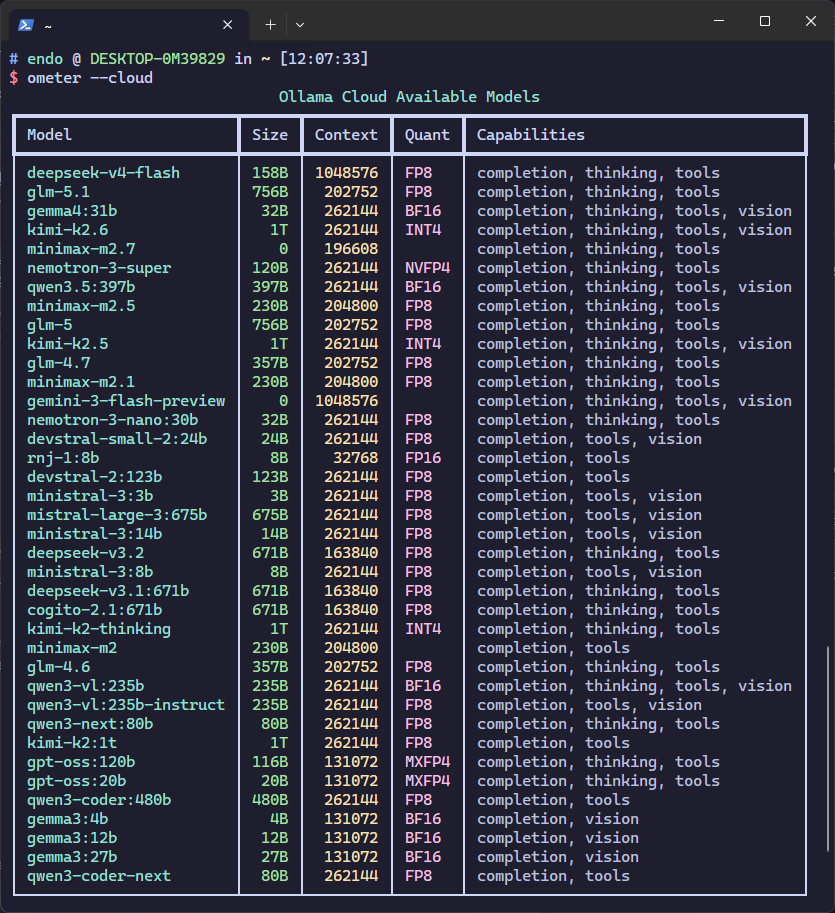
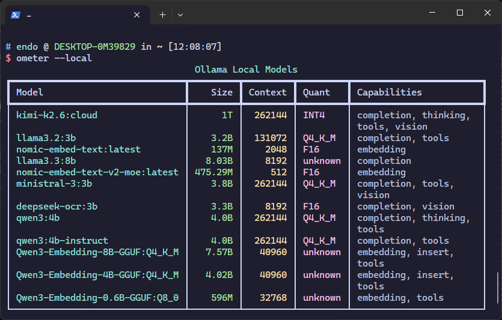
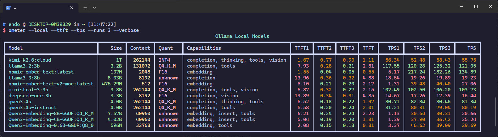

# OllamaMeter

<p align="left">
  
  
</p>

Benchmark and compare Ollama models across local and cloud endpoints with rich, sortable tables.

## Features

- 📋 **List models** from local and cloud Ollama endpoints
- 📊 **Rich tables** with sorting by modification date (newest first)
- ⏱️ **Benchmark** time-to-first-token (TTFT) and tokens-per-second (TPS)
- 🔍 **Single-model mode** for targeted benchmarking
- 🧪 **Multi-prompt averaging** — 3 prompts per model for robust stats
- 🧬 **Embedding model support** — automatically uses `/api/embed` for local embedding models
- 🎨 **Beautiful CLI** powered by `rich` + `InquirerPy`

## Preview

<details name="screenshots" open>
<summary><strong>Cloud model listing</strong> — <code>ometer --cloud</code></summary>

</details>

<details name="screenshots">
<summary><strong>Local model listing</strong> — <code>ometer --local</code></summary>

</details>

<details name="screenshots">
<summary><strong>Benchmark with per-run breakdown</strong> — <code>ometer --local --ttft --tps --verbose --runs 2 --parallel 1</code></summary>

</details>

## Installation

### Install as a uv tool (recommended)

From the project directory:

```bash
uv tool install .
```

Or install directly from GitHub:

```bash
uv tool install git+https://github.com/EndoTheDev/OllamaMeter.git
```

This installs `ometer` and `ollamameter` globally, so you can run them from anywhere.

**Update:**

```bash
uv tool install --upgrade ometer
```

**Uninstall:**

```bash
uv tool uninstall ometer
```

### Install into a project

```bash
uv add ometer
```

Or via pip:

```bash
pip install ometer
```

## Usage

List models with an **interactive menu**:

```bash
ometer
```

List **local** models only:

```bash
ometer --local
```

List **cloud** models only:

```bash
ometer --cloud
```

List **both** local and cloud models:

```bash
ometer --local --cloud
```

Benchmark **time-to-first-token** and **tokens-per-second**:

```bash
ometer --cloud --ttft --tps
```

Benchmark models in **parallel** for faster results (default is 1 — max 10):

```bash
ometer --cloud --ttft --tps --parallel 4
```

Show **per-run breakdown** in the table:

```bash
ometer --cloud --ttft --tps --verbose
```

Run with **fewer benchmark prompts** for faster results (default is 3 — max 3):

```bash
ometer --cloud --ttft --tps --verbose --runs 1
ometer --cloud --ttft --tps --verbose --runs 2
```

Filter to a **specific model** (searches both local and cloud if no endpoint flag is given):

```bash
ometer --model glm-5.1 --ttft --tps
```

Combined with an endpoint flag:

```bash
ometer --cloud --model glm-5.1 --ttft --tps
```

See all options:

```bash
ometer --help
```

## Environment Variables

OllamaMeter looks for a `.env` file in this order, using the **first one found**:

1. **`./.env`** — current working directory (project-specific)
2. **`~/.env`** — home directory (global fallback)
3. **`~/.config/ometer/.env`** — dedicated config directory (recommended for global installs)

Create the config directory and file:

```bash
mkdir -p ~/.config/ometer
cat > ~/.config/ometer/.env << 'EOF'
OLLAMA_CLOUD_BASE_URL=https://ollama.com
OLLAMA_CLOUD_API_KEY=your_api_key_here
OLLAMA_LOCAL_BASE_URL=http://localhost:11434

# Number of benchmark prompts per model (1–3, default 3)
OLLAMAMETER_RUNS=3

# Number of models benchmarked in parallel (default 1, max 10)
OLLAMAMETER_PARALLEL=1
EOF
```

The cloud API key is **only needed for benchmarking cloud models**.

## Architecture

OllamaMeter has four modules that handle distinct concerns:

```txt
User ──► cli.py ──► config.py ──► api.py ──► display.py
          │             │            │            │
     arg parsing    .env load    HTTP calls    rich tables
     mode resolve   validate     benchmark     color thresholds
     interactive     clamp       stream        live updates
```

- **cli.py** — Entry point, argument parsing, interactive model selection
- **config.py** — Hierarchical `.env` loading, settings validation and clamping
- **api.py** — HTTP communication with Ollama, TTFT/TPS measurement
- **display.py** — Rich terminal UI, live table updates, percentile-based color coding

For detailed documentation, see the [docs](docs/) directory:

- [Architecture](docs/architecture.md) — Module decomposition, request lifecycle, data entities
- [Benchmarking Pipeline](docs/benchmarking.md) — TTFT/TPS methodology, concurrency, color thresholds
- [Configuration](docs/configuration.md) — Environment variables, CLI flags, loading order
- [API Reference](docs/api-reference.md) — Ollama endpoints, function reference, BenchmarkResult
- [Development](docs/development.md) — Dev setup, running tests, project structure, conventions

## CLI Commands

Both `ometer` and `ollamameter` work identically:

```bash
# These are the same:
ometer --cloud
ollamameter --cloud
```

## License

MIT License — see [LICENSE](LICENSE) for details.

---

Made by [EndoTheDev](https://github.com/EndoTheDev)
